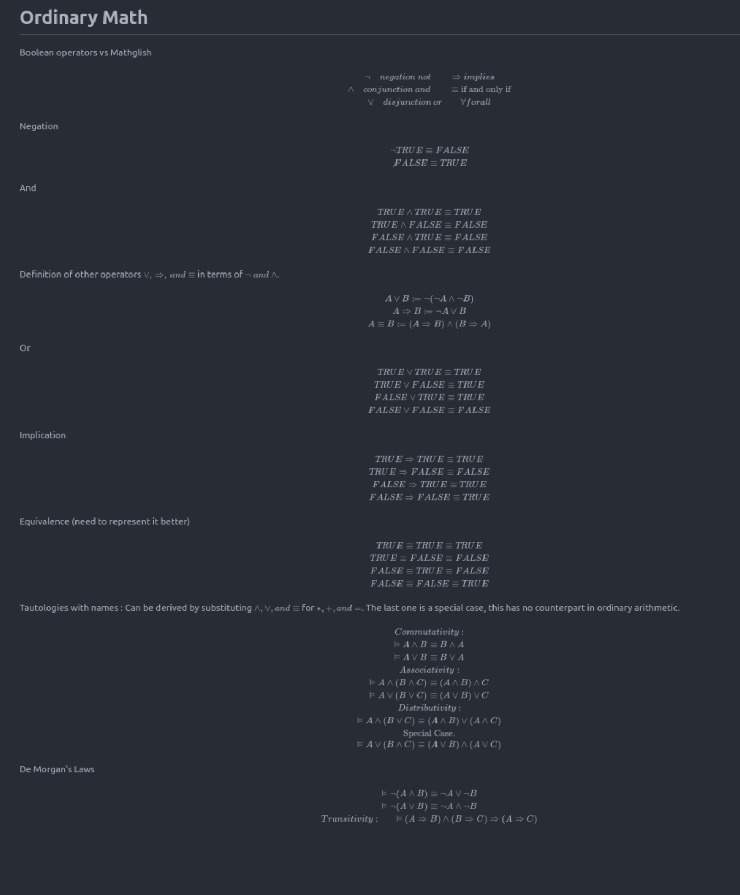

I have started reading the book [A Science of Concurrent progam PDF](https://lamport.azurewebsites.net/tla/science.pdf). Don't remember where I got it from, but am interested after reading the first few pages.

I've come across Leslie Lamport, the author, first when I was reading about [Consensus](<https://en.wikipedia.org/wiki/Consensus_(computer_science)>) and then it lead to [time & clocks](https://lamport.azurewebsites.net/pubs/time-clocks.pdf). There are several more reasons to pay attention to Leslie Lamport's work, one more I just learnt today that 'LA' in LaTeX is for Lamport in recognition of his contribution to LaTeX.

I want to read this book so that I am able to think mathematically of programs in general. As a professional programmer, there aren't many opportunities to think about programs mathematically.

Also, this will be an excuse for me to get more familiar with LaTeX.

I've created [github](https://github.com/vikrampawar/pdfs/tree/main/2024/science-of-concurrent-programs) repo folder to keep the PDF and the notes.

Refreshing basics and in the process getting acquainted with LaTeX.

Link to the below page as markdown [here](https://github.com/vikrampawar/pdfs/blob/main/2024/science-of-concurrent-programs/OrdinaryMath.md).

